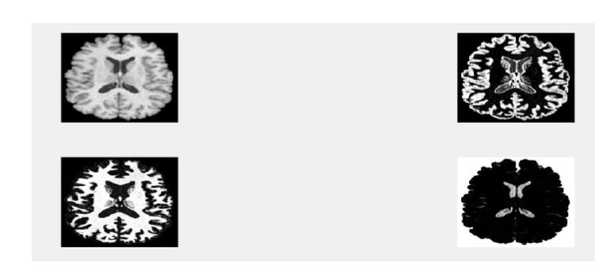

# FCM-method-for-brain-MRI-segmentation
## In this project we want simulate a article about segmentation of brain MRI image

there are matlab code in : code file

Basically our brain has consist of 3 major part :

                                                  1- Gray matter (GM)
                                                  2- White matter (WM)
                                                  3- Cerebrospinal fluid (CSF)
                                                  
                                                  
segmentation of these parts of brain in MRI images is very useful for diognosis of some brain deseases .

there are some ways for segmentation :

            1) FLICM
            a. Based on FCM and using a fuzzy local similarity measure to reduce the effect of the noise
            b. modified the FCM objective function by
            introducing a spatial penalty term
            
            2) GMM
            a. models the pixel intensities by using a mixed Gaussian distribution
            b. reduce the segmentation sensitivity to noise
            
            3) RSCFCM
            a. Based on FCM and proposed spatial factor is constructed based on the posterior probabilities and prior probabilities
            b. overcome the impact of noise
            c. estimate the bias field
            
            4) NLSCHFCM
            a. Based on FCM and a new factor constructed by weighted combination of posterior probabilities and prior probabilities of                 e           ighborhood is incorporated to regularization term
            b. preserve more abundant details in brain MR images
            c. reducing the effect of the noise and bias field effectively
            d. the distance function is constructed by using Gaussian distribution
                                                  
### now we want use a way "Non-local-based spatially constrained fuzzy C-means ( NLSCFCM )"  ro segment of this part.

## result 

